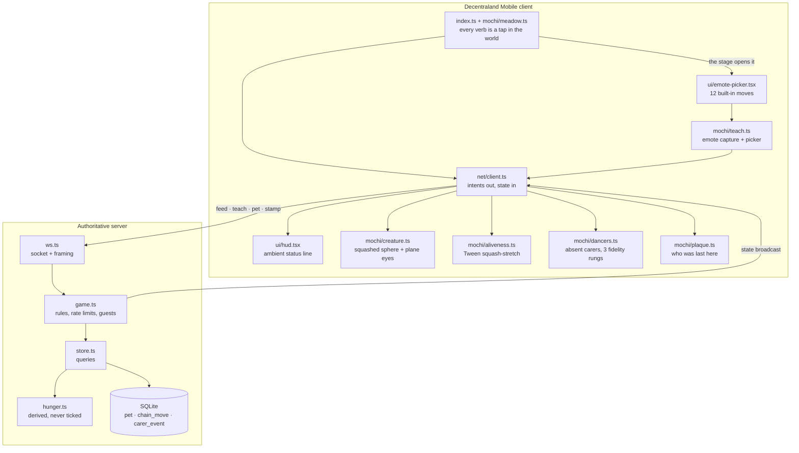

# Architecture

Written from the code, after building it. Every file named here exists, and
the line counts were measured rather than estimated.

## The shape of it

One creature, owned by a server, rendered by a scene that keeps no state of
its own.



## Why the client owns nothing

The scene sends *intents* and renders the state it is given. It has no feed
counter, no local chain, and no clock of its own. That is not a purity
argument — it is the only way the creature can be the same creature for
everybody. A client that kept its own count would drift, and the whole claim
of the design is that its size is the sum of *everyone's* feedings.

The one exception is animation, which plays optimistically the moment you tap.
The gulp is a local flourish; the feeding is not real until the server says so.

## Three decisions that shaped the code

### Growth and breathing live on different entities

Size is persistent state that hundreds of visitors contribute to. Breathing,
waddling and the eat gulp are transient motion. Both are *scale*. Sharing one
Transform would mean every breath silently overwrote the accumulated growth of
everyone who had ever visited.

So `creature.ts` builds a root that carries position and growth and is never
tweened, and a child body that carries the mesh and receives every tween. See
the comment at the top of that file.

### Hunger is derived, not ticked

`hunger.ts` stores a value and a timestamp and recomputes the current level on
read. Nothing runs on a timer. A server that is restarted, redeployed or moved
between hosts comes back with exactly the hunger it should have, because there
was never any in-memory countdown to lose.

It decays toward a **floor**, never to zero. An unvisited creature should read
as needy, not as dying.

### The memory dancers are a ladder, not a feature

Dancers are the only elastic cost in the scene, and the one element with a
documented risk of not rendering on the mobile client at all. `dancers.ts`
therefore treats fidelity as a variable:

```
avatars-6  →  avatars-3  →  nametags
```

The bottom rung draws the same idea more cheaply — a name floating where a
person stood. Chain, credit and order survive at every rung, so a frame-rate
problem or a platform gap can make the clearing plainer but cannot take the
mechanic away.

`fidelity-watchdog.ts` is what pulls it. It watches an exponential moving
average of frame time and drops one rung when that average stays worse than
30 fps for five seconds. Smoothed and sustained, because teaching a move
rebuilds the ring and costs a visible frame — a single expensive frame is not
evidence that a phone cannot cope, and must not permanently degrade a scene for
someone whose device is otherwise fine. The first eight seconds are ignored
outright: scene load, wearable fetches and avatar instantiation all land there
and none of them describe the steady state.

It only ever goes down. Climbing back would thrash — every rung change destroys
and rebuilds every dancer, so a device hovering near the threshold would pay
that cost over and over and look broken while doing it, which is the exact cost
the ladder exists to avoid.

This was measured, not assumed: on a real phone the scene read about 90% on the
Scene Limits panel with an empty clearing and fell to roughly 70% once the
ghosts accumulated. Until 2026-08-24 the ladder was dead code — `setFidelity`
was exported and tested but never called from `src`, so every device got six
avatars regardless. The two paragraphs above used to describe a behaviour this
scene did not have.

The ring is also **idempotent**, which turned out to matter more than the
ladder. The server broadcasts the whole world after every successful mutation,
including a pet — ten a minute per wallet — and almost none of those change the
chain. `setDancers` compares a signature of the moves, their teachers, their
wearables and their order against what is already standing, and returns without
touching the engine when they match. Object identity would be no use: every
broadcast arrives as freshly parsed JSON.

Measured over twenty broadcasts of which two were teaches, that is **18 avatar
entities built instead of 120** — see `test/dancers.test.ts`, which fails
without the guard.

## Data model

Three tables. One append-only log and one row of derived state.

| Table | Rows | Purpose |
|---|---|---|
| `pet` | exactly 1 | hunger, `feed_count`, who fed last and when |
| `chain_move` | append-only | the communal dance, one credited move per row |
| `carer_event` | append-only | every feed, teach, pet and stamp, with a name |

`chain_move.teacher_name` is `NOT NULL` at the schema level. An anonymous
chain is a leaderboard, and a leaderboard is not what this is.

There is no delete verb anywhere in the server.

## The away-line

The one query worth calling out. On connect, the server looks for the first
`carer_event` by a **different** wallet that happened after your own most
recent one, and returns that person's name.

The client renders one sentence: *"Rue fed Mochi after you left."*

Everything else in the design is broadcast to a room. This is addressed to a
person. It costs one indexed query and it is the only message in the protocol
that is never included in a broadcast.

## Failure behaviour

| Situation | What happens |
|---|---|
| Connection drops | The last state stays on screen, animation keeps playing, intents queue and replay on reconnect. **The screen is never cleared.** |
| Server restarts | State is on disk; hunger recomputes from its timestamp |
| Guest account | Connects, receives everything, renders everything, writes nothing |
| Rate limited | The intent is refused with a reason; the creature is unchanged |
| Nobody visits for days | Hunger decays to its floor and stops |

A visitor arriving during an outage sees a slightly stale creature with a
history. A client that blanked on disconnect would show them an empty field —
which is the exact emptiness this project exists to answer.

## Layout

| Path | Lines | What |
|---|---|---|
| `src/index.ts` | 281 | wiring, the world-tap system for all four verbs, deferred ring rebuild |
| `src/mochi/` | 1,505 | creature, aliveness, dancers, meadow, plaque, teach |
| `src/ui/` | 303 | status line, emote picker, touch controls |
| `src/net/client.ts` | 182 | connection, queue, reconnect |
| `src/probe/` | 467 | day-one capability probe (see `docs/PROBE.md`) |
| `server/src/` | 1,427 | protocol, rules, store, hunger, transport |
| `server/test/` | 2,638 | 238 tests at 100% line/branch coverage, one exhaustive |
| `test/` | 549 | 36 headless scene tests — the ring, the fidelity ladder, the parcel budget |
| `server/scripts/bench.ts` | 432 | the protocol benchmark behind the latency table |
| `scripts/scene_budget.ts` | 205 | the one-parcel budget audit |

Scene and server share one definition of the wire format: `server/src/protocol.ts`
has no imports at all, so the scene includes it directly and the two cannot
disagree about what a message is.

## Stack

Decentraland SDK7 · TypeScript · react-ecs for UI · Tween/TweenSequence for
all motion · Node + `ws` on the server · SQLite through Node's built-in
`node:sqlite`, which is why the server has exactly one dependency and no
native module to rebuild.

Nothing on-chain. No wallet adapter, no contract, no token, no model.
