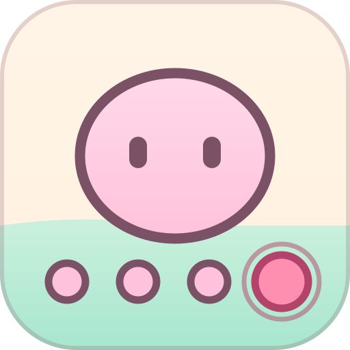
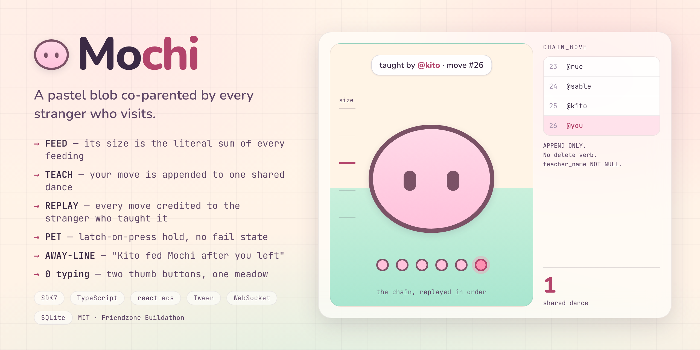

<div align="center">



# Mochi

**A giant pastel blob co-parented by every stranger who visits.**



**[Visit Mochi →](«PENDING:world-url»)**

`SDK7` · `TypeScript` · `react-ecs` · `Tween` · `WebSocket` · `SQLite` · `MIT`

</div>

---

## 🫧 What it is

Decentraland Mobile has no reason to be opened twice. Its worlds are venues —
wonderful when full, dead when empty, which is almost always. You arrive alone,
find an empty room, and nothing tells you anyone was ever there or cared.

Mochi is the opposite of a venue. It is one creature whose entire body is the
record of everyone who has ever tended it.

- **Its size is the literal sum of every feeding.** Not a counter next to it —
  the blob is physically bigger because people fed it.
- **Its dance is a chain.** Each move was taught by one named person. When
  Mochi performs, it replays the whole chain in order, crediting every move to
  the stranger who taught it, beside dancers wearing those people's real
  wearables.
- **Its plaque names the last human.** *"Last fed by Kito, 3h ago"* — and the
  hunger has visibly drained since.

So a visitor alone at 2am both **receives** evidence of other people and
**leaves** state that every future visitor inherits. No co-presence, no host,
no schedule.

## 📱 How it was designed and optimised for mobile

Portrait, one-handed, **zero typing anywhere**.

**Two buttons, ever.** FEED and TEACH sit in the bottom thumb arc. Petting is a
hold on the creature's own body and signing the guestbook is a tap on the
totem, so neither needs screen furniture. There is no tutorial, no onboarding
modal and no instruction text — every affordance is carried by motion, scale
and one verb per button.

**Tap and press only.** The mobile client exposes no drag deltas —
`screenDelta` reports zero there and gestures are not planned — so the entire
vocabulary is press and release. That is not a compromise: the hold to pet
**latches on press** and completes on a timer, so a thumb that slides off the
creature does not cancel it. There is no fail state anywhere in the scene.

**A budget kept 15× under the platform's own limits.** The creature is a
sub-2k-triangle sphere with two plane eyes, animated entirely by Tween
squash-stretch — no rig, no sculpt, no animation data. Warmth comes from
emissive materials because the mobile client has no dynamic lights.

The only elastic cost is the ring of memory dancers, and it is built as a
ladder — six avatars, three, or floating name-tags — so a slow device gets a
plainer clearing rather than a broken one.

## 🤝 How it encourages social interaction

Every visible property of the creature was produced by somebody else.

The strongest version of this is one sentence. When you arrive, the server
finds the first act by a **different** person that happened after your own last
one, and tells you:

> **Rue fed Mochi after you left.**

Everything else in the design is broadcast to a room. That line is addressed to
a person. It is one indexed query, and it turns care from something announced
into something directed.

Underneath, `chain_move.teacher_name` is `NOT NULL` at the schema level and
there is no delete verb anywhere in the server. An anonymous chain would be a
leaderboard; a leaderboard is not what this is.

## 🔁 Why people come back

Because it is hungry, and because someone else has been.

Hunger decays toward a **floor**, never to zero — an unvisited creature reads
as needy, never as dying or abandoned. Nothing is ever punished, lost or
reset.

The return hook is not a streak or a notification. It is that the thing you
helped raise has changed since you left, in ways specific people caused, and
the plaque will tell you who. Teach it a move and five seconds later you are
watching a performance authored by named strangers that ends with **you** —
and that performance stays there for everyone who comes after.

## 🧪 Try it

Full steps in **[DEMO.md](DEMO.md)** — including how to see the away-line,
which needs two people.

```bash
cd server && npm install && npm start   # Node 22.5+
npm install && npm run start:mobile     # prints a QR for your phone
```

Nothing is mocked. The local run uses the same server, schema and protocol as
the deployed one.

## 🏗 How it works

The scene owns **no state**. It sends intents and renders what the server says,
so the creature is the same creature for everybody.

See **[ARCHITECTURE.md](ARCHITECTURE.md)** for the diagram and the three
decisions that shaped the code — including why growth and breathing live on
different entities, and why hunger is derived rather than ticked.

```bash
cd server && npm test    # 82 tests, 16 suites
```

## ⚡ Performance

**«PENDING:perf-score»%** on the in-client Scene Limits panel — Samsung Galaxy
A54, High graphics profile, Dynamic Graphics off.

You do not have to take our word for it. In-Game Menu → Settings → Graphics →
Dynamic Graphics off → High, then the monitor icon at the top right.

## 🙏 Honest limitations

- **Emote observation is unverified on mobile.** Catching a move a visitor
  performs with the client's own emote wheel depends on behaviour the platform
  docs do not settle. The in-scene picker does not depend on it and is the
  route the demo uses, so what is at risk is spontaneity, not the mechanic.
- **Audio is decorative.** The mobile client has no audio event
  implementation, so nothing in the design depends on sound.
- **The server is a single process with a single SQLite file.** Correct for one
  creature and a few hundred carers; it is not built to shard.

## 📄 License

MIT — see [LICENSE](LICENSE).
