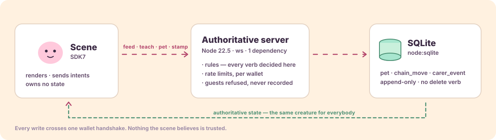

<div align="center">
  
  <h1>Mochi 🍡</h1>
  <p><em>A giant pastel blob co-parented by every stranger who visits.</em></p>
  

  <p>
    Its size is the <strong>literal sum of every feeding</strong>, and its dance is a chain
    where each move was taught by a named stranger. Verify it yourself in 30 seconds —
    see <a href="JUDGE.md">JUDGE.md</a>.
  </p>

  <br/>

  [](https://decentraland.org/jump/?realm=wunderland.dcl.eth)

  <details>
  <summary><strong>📱 Or scan to open it on your phone</strong> — it was built for a thumb</summary>
  <br/>
  
  <p><code>https://decentraland.org/jump/?realm=wunderland.dcl.eth</code></p>
  </details>

  <br/>

  [](https://mochi.edycu.dev)
  [](JUDGE.md)

  [](https://mochi.edycu.dev/deck/)
  [](https://dorahacks.io/buidl/48053)
  [](https://dorahacks.io/hackathon/friendzone)

  <br/>

  
  
  
  
  [](https://opensource.org/licenses/MIT)
  [](https://github.com/edycutjong/mochi/actions/workflows/ci.yml)

</div>

---

## 💡 The Problem & Solution

### The Problem

Decentraland Mobile has no reason to be opened twice. Its worlds are venues —
wonderful when full, dead when empty, which is almost always. You arrive alone,
find an empty room, and nothing tells you anyone was ever there or cared.

### The Solution

Mochi is the opposite of a venue. It is one creature whose entire body is the
record of everyone who has ever tended it.

- **Its size is the literal sum of every feeding.** Not a counter next to it —
  the blob is physically bigger because people fed it.
- **Its dance is a chain.** Each move was taught by one named person. When
  Mochi performs, it replays the whole chain in order, crediting every move to
  the stranger who taught it, beside dancers wearing those people's real
  wearables.
- **Its plaque names the last human.** *"Last fed by Kito, 3h ago"* — and the
  hunger has visibly drained since.

So a visitor alone at 2am both **receives** evidence of other people and
**leaves** state that every future visitor inherits. No co-presence, no host,
no schedule.

## 📱 Designed and Optimised for Mobile

Landscape, thumb-driven, **zero typing anywhere**. The Decentraland mobile
client renders the world in landscape at the device's full aspect — measured at
2.18:1 on a Galaxy S24 Ultra — so that is the shape this scene is designed and
tested for.

**No buttons at all.** Every verb is a tap on something in the meadow: FEED is
the bowl of berries in front of the creature, TEACH is the pale stage beside
it, PET is a hold on the creature's own body, and signing the guestbook is a
tap on the totem. The scene draws nothing over the bottom of the screen. There
is no tutorial, no onboarding modal and no instruction text — a visitor knows
what the bowl and the stage are from where they stand, what they look like, and
a single billboarded word floating over each, the same way the memory dancers
carry their names.

**Why it is built that way, honestly.** It used to be two buttons in a bottom
thumb arc, which is where Decentraland's own mobile guidance puts actions. On a
real phone, on 2026-08-23, that arc landed directly on top of the client's own
controls — it covered the movement joystick and the emote buttons either side
of it, and a tap aimed at jump landed on TEACH, which writes a permanent row to
an append-only chain that has no delete verb. Decentraland warns that scene UI
"will clash with the system controls" but does not publish where those controls
sit, and two attempts to dodge them by adjusting percentages both failed on the
device. So the arc was deleted rather than tuned: owning none of that strip is
the only fix that cannot be wrong. The change removed HUD code instead of
adding more, and it moved FEED and TEACH onto the same world-space pattern that
PET and STAMP were already using successfully.

**Tap and press only.** The mobile client exposes no drag deltas —
`screenDelta` reports zero there and gestures are not planned — so the entire
vocabulary is press and release. That is not a compromise: the hold to pet
**latches on press** and completes on a timer, so a thumb that slides off the
creature does not cancel it. There is no fail state anywhere in the scene.

**A budget measured, not asserted.** At its most expensive the scene builds
**32 entities against the 200 a parcel allows** — 16.0%, or 6.3× under — and
**14 materials against 20**, which is the tight dimension at 70%. No texture is
loaded anywhere. Those figures come from `npm run budget:scene`, which builds
the real scene graph against the real engine and counts it, against
`@dcl/inspector`'s own per-parcel limits; `npm run test:scene` fails the build
if an addition ever breaks them. Triangles are the renderer's own count and
cannot be measured outside the client, so no triangle figure is claimed here.

The creature is a sphere with two plane eyes, animated entirely by Tween
squash-stretch — no rig, no sculpt, no animation data. Warmth comes from
emissive materials because the mobile client has no dynamic lights.

The only elastic cost is the ring of memory dancers, and it is built as a
ladder — six avatars, three, or floating name-tags — so a slow device gets a
plainer clearing rather than a broken one. It is also idempotent: the server
broadcasts the whole world after every pet, and the ring redraws only when the
chain behind it actually moved. Over a plausible minute that is **18 avatar
entities built instead of 120**.

## 🤝 How It Encourages Social Interaction

Every visible property of the creature was produced by somebody else.

The strongest version of this is one sentence. When you arrive, the server
finds the first act by a **different** person that happened after your own last
one, and tells you:

> **Rue fed Mochi after you left.**

Everything else in the design is broadcast to a room. That line is addressed to
a person. It is one indexed query, and it turns care from something announced
into something directed.

*Kito and Rue are names from the four-session local run recorded in
[DEMO.md](DEMO.md), used here to show the shape of the sentence. They are not
people in the live world — `/state` is the authority on who is.*

Underneath, `chain_move.teacher_name` is `NOT NULL` at the schema level and
there is no delete verb anywhere in the server. An anonymous chain would be a
leaderboard; a leaderboard is not what this is.

## 🔁 Why People Come Back

Because it is hungry, and because someone else has been.

Hunger decays toward a **floor**, never to zero — an unvisited creature reads
as needy, never as dying or abandoned. Nothing is ever punished, lost or
reset.

The return hook is not a streak or a notification. It is that the thing you
helped raise has changed since you left, in ways specific people caused, and
the plaque will tell you who. Teach it a move and five seconds later you are
watching a performance authored by named strangers that ends with **you** —
and that performance stays there for everyone who comes after.

## 🏗️ Architecture & Tech Stack

The scene owns **no state**. It sends intents and renders what the server says,
so the creature is the same creature for everybody.

| Layer | Technology |
|---|---|
| **Scene** | Decentraland SDK7, TypeScript |
| **UI** | react-ecs |
| **Animation** | Tween / TweenSequence — no rig, no animation data |
| **Server** | Node 22.5+, `ws` |
| **Persistence** | SQLite via Node's built-in `node:sqlite` |
| **Runtime dependencies** | **1** (`ws`) |



See **[ARCHITECTURE.md](ARCHITECTURE.md)** for the full diagram and the three
decisions that shaped the code — including why growth and breathing live on
different entities, and why hunger is derived rather than ticked.

## 📊 Engineering Rigor

| Metric | Value |
|---|---|
| Tests | **238** server across 13 files · **36** headless scene across 3 |
| Server coverage | **100%** lines · **100%** branches · **100%** functions |
| Exhaustive verification | **78,482 combinations** |
| Real run | 4 sessions, 6 intents, **1,845 ms**, 4,096-byte database |
| Intent latency | **p50 0.67 ms · p95 0.94 ms · p99 2.29 ms** over N=2,160 |
| `GET /state` | **p50 0.54 ms · p95 0.90 ms · p99 2.32 ms** at a 40-move chain |
| Throughput | **425 intents/s**, 24 concurrent wallets, 12,120 frames fanned out |
| Scene budget | **32/200 entities · 14/20 materials · 0/10 textures**, 1 parcel |
| Provider cost | **$0.00** — no external API, no model, nothing on-chain |
| Deployable payload | **6,888 KB** against the 25,000 KB gate CI enforces |
| Scene performance | **88–90%**, Galaxy S24 Ultra, High profile, Dynamic Graphics off |

The exhaustive test sweeps every stored hunger value against every elapsed time
against every configuration — including NaN, ±Infinity, negative values, values
above 1, and time running backwards from a clock correction. **None of them
produces a creature that starves.** That property is the emotional premise of
the whole design, so it is verified across its input space rather than at a
handful of points.

Every row above was produced by a command in this repository — `npm run bench`
for the latency and throughput figures, `npm run budget:scene` for the parcel
budget — except the last, which is the Decentraland client's own reading of a
deployed scene on a real phone and cannot be produced by any script here. It is
left unfilled rather than approximated from the numbers that can.

Full measured receipt, with the command beside every number, in
**[DEMO.md](DEMO.md)**.

## 🚀 Getting Started

### Prerequisites

- **Node.js 22.5+** — the server uses the SQLite driver built into the runtime,
  so there is nothing to compile
- The Decentraland mobile app, on the same Wi-Fi as your machine

### Installation

```bash
cd server && npm install && npm start   # authoritative server on :8080
npm install && npm run start:mobile     # prints a QR code for your phone
```

Nothing is mocked. The local run uses the same server, schema and protocol as
the deployed World.

Full walkthrough — including how to see the away-line, which needs two
people — in **[DEMO.md](DEMO.md)**.

## 🧪 Testing & CI

```bash
npm test               # 238 server tests, 13 files
npm run test:coverage  # the same, plus the coverage table
npm run test:scene     # 41 headless scene tests, 4 files
npm run budget:scene   # the one-parcel budget audit
npm run bench          # the protocol benchmark — p50/p95/p99, ~30 seconds
npm run lint           # type-aware ESLint
npm run build          # scene bundle + typecheck
npm run ci             # everything CI runs, in one command
```

All of these work from the repository root, once `npm install` has been run
here **and** in `server/` — the two steps in Getting Started above.

`test:coverage` also writes a browsable report to `server/coverage/index.html`,
green line by green line, plus an `lcov.info` your editor can read. Neither is
committed.

Almost all of the tests live in `server/`, because everything with logic in it
lives in the server and that is the half held at 100%. The scene cannot be
tested the same way: it renders only inside the Decentraland client, and the
parts that reach for the client runtime — the react-ecs HUD, anything importing
`~system/*` — cannot even be loaded outside it.

`@dcl/ecs` itself can, though. The engine underneath `@dcl/sdk/ecs` is ordinary
TypeScript with no renderer attached, so entities, components and systems can be
driven headlessly. `test/` uses that for exactly two things that used to be
answerable only on a phone: that a state broadcast does not tear down and
rebuild the ring of avatars, and that the whole scene fits inside one parcel's
published budget. Nothing there asserts about anything visual, because nothing
there can see.

| Layer | Tool |
|---|---|
| Scene build + typecheck | `sdk-commands build` |
| Scene behaviour + parcel budget | vitest over a headless `@dcl/ecs` engine |
| Server tests + coverage | vitest + v8, thresholds at 100% |
| Static analysis | CodeQL |
| Secret scanning | TruffleHog (CI) + gitleaks over full history |
| Dependency audit | Dependabot + `npm audit` |
| Submission gate | `scripts/check_submission_readiness.ts` |
| Versioning | semantic-release — SemVer derived from Conventional Commits |

Releases are cut automatically and only after the whole pipeline is green: the
release workflow is triggered by a **successful** CI run rather than by a push,
so a version tag always points at a commit whose tests actually passed. The
version, the tag, `CHANGELOG.md` and the GitHub Release all come from the commit
messages — nothing is bumped by hand.

## 🔗 Where to Find It

| | |
|---|---|
| 🫧 **Live World** | **[wunderland.dcl.eth](https://decentraland.org/jump/?realm=wunderland.dcl.eth)** — open in the Decentraland mobile app |
| 🌐 **Landing page** | **[mochi.edycu.dev](https://mochi.edycu.dev/)** — the creature on the page is sized by the real feed count |
| 🎞️ **Pitch deck** | **[mochi.edycu.dev/deck](https://mochi.edycu.dev/deck/)** — 12 slides, works offline |
| 🎥 **Demo video** | «PENDING:video-url» |
| 🏆 **BUIDL** | [dorahacks.io/buidl/48053](https://dorahacks.io/buidl/48053) — DoraHacks [Friendzone Buildathon](https://dorahacks.io/hackathon/friendzone) |
| 📋 **For judges** | [JUDGE.md](JUDGE.md) — every number, and how to check it in 30 seconds |
| 🩺 **Server health** | [api.mochi.edycu.dev/health](https://api.mochi.edycu.dev/health) · [/state](https://api.mochi.edycu.dev/state) |

Both web surfaces redeploy from `main` on every commit that passes CI, so
neither can drift ahead of a green build.

## ⛓️ Live Deployment

**World:** https://decentraland.org/jump/?realm=wunderland.dcl.eth

Deployed to a Decentraland World and publicly accessible throughout judging.

## 🙏 Honest Limitations

- **Emote observation is unverified on mobile.** Catching a move a visitor
  performs with the client's own emote wheel depends on behaviour the platform
  docs do not settle. The in-scene picker does not depend on it and is the
  route the demo uses, so what is at risk is spontaneity, not the mechanic.
- **Audio is decorative.** The mobile client has no audio event
  implementation, so nothing in the design depends on sound.
- **The server is a single process with a single SQLite file.** Correct for one
  creature and a few hundred carers; it is not built to shard.

## 📄 License

MIT — see [LICENSE](LICENSE).
