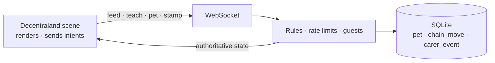

<div align="center">
  
  <h1>Mochi 🫧</h1>
  <p><em>A giant pastel blob co-parented by every stranger who visits.</em></p>
  

  <p>
    Its size is the <strong>literal sum of every feeding</strong>, and its dance is a chain
    where each move was taught by a named stranger. Verify it yourself in 30 seconds —
    see <a href="JUDGE.md">JUDGE.md</a>.
  </p>

  <br/>

  [](https://dorahacks.io/hackathon/friendzone)
  [](JUDGE.md)

  <br/>

  
  
  
  
  [](https://opensource.org/licenses/MIT)
  [](https://github.com/edycutjong/mochi/actions/workflows/ci.yml)

</div>

---

## 💡 The Problem & Solution

### The Problem

Decentraland Mobile has no reason to be opened twice. Its worlds are venues —
wonderful when full, dead when empty, which is almost always. You arrive alone,
find an empty room, and nothing tells you anyone was ever there or cared.

### The Solution

Mochi is the opposite of a venue. It is one creature whose entire body is the
record of everyone who has ever tended it.

- **Its size is the literal sum of every feeding.** Not a counter next to it —
  the blob is physically bigger because people fed it.
- **Its dance is a chain.** Each move was taught by one named person. When
  Mochi performs, it replays the whole chain in order, crediting every move to
  the stranger who taught it, beside dancers wearing those people's real
  wearables.
- **Its plaque names the last human.** *"Last fed by Kito, 3h ago"* — and the
  hunger has visibly drained since.

So a visitor alone at 2am both **receives** evidence of other people and
**leaves** state that every future visitor inherits. No co-presence, no host,
no schedule.

## 📱 Designed and Optimised for Mobile

Portrait, one-handed, **zero typing anywhere**.

**Two buttons, ever.** FEED and TEACH sit in the bottom thumb arc. Petting is a
hold on the creature's own body and signing the guestbook is a tap on the
totem, so neither needs screen furniture. There is no tutorial, no onboarding
modal and no instruction text — every affordance is carried by motion, scale
and one verb per button.

**Tap and press only.** The mobile client exposes no drag deltas —
`screenDelta` reports zero there and gestures are not planned — so the entire
vocabulary is press and release. That is not a compromise: the hold to pet
**latches on press** and completes on a timer, so a thumb that slides off the
creature does not cancel it. There is no fail state anywhere in the scene.

**A budget kept 15× under the platform's own limits.** The creature is a
sub-2k-triangle sphere with two plane eyes, animated entirely by Tween
squash-stretch — no rig, no sculpt, no animation data. Warmth comes from
emissive materials because the mobile client has no dynamic lights.

The only elastic cost is the ring of memory dancers, and it is built as a
ladder — six avatars, three, or floating name-tags — so a slow device gets a
plainer clearing rather than a broken one.

## 🤝 How It Encourages Social Interaction

Every visible property of the creature was produced by somebody else.

The strongest version of this is one sentence. When you arrive, the server
finds the first act by a **different** person that happened after your own last
one, and tells you:

> **Rue fed Mochi after you left.**

Everything else in the design is broadcast to a room. That line is addressed to
a person. It is one indexed query, and it turns care from something announced
into something directed.

Underneath, `chain_move.teacher_name` is `NOT NULL` at the schema level and
there is no delete verb anywhere in the server. An anonymous chain would be a
leaderboard; a leaderboard is not what this is.

## 🔁 Why People Come Back

Because it is hungry, and because someone else has been.

Hunger decays toward a **floor**, never to zero — an unvisited creature reads
as needy, never as dying or abandoned. Nothing is ever punished, lost or
reset.

The return hook is not a streak or a notification. It is that the thing you
helped raise has changed since you left, in ways specific people caused, and
the plaque will tell you who. Teach it a move and five seconds later you are
watching a performance authored by named strangers that ends with **you** —
and that performance stays there for everyone who comes after.

## 🏗️ Architecture & Tech Stack

The scene owns **no state**. It sends intents and renders what the server says,
so the creature is the same creature for everybody.

| Layer | Technology |
|---|---|
| **Scene** | Decentraland SDK7, TypeScript |
| **UI** | react-ecs |
| **Animation** | Tween / TweenSequence — no rig, no animation data |
| **Server** | Node 22.5+, `ws` |
| **Persistence** | SQLite via Node's built-in `node:sqlite` |
| **Runtime dependencies** | **1** (`ws`) |



See **[ARCHITECTURE.md](ARCHITECTURE.md)** for the full diagram and the three
decisions that shaped the code — including why growth and breathing live on
different entities, and why hunger is derived rather than ticked.

## 📊 Engineering Rigor

| Metric | Value |
|---|---|
| Tests | **220** across 13 files |
| Server coverage | **100%** lines · **100%** branches · **100%** functions |
| Exhaustive verification | **78,482 combinations** |
| Real run | 4 sessions, 6 intents, **1,845 ms**, 4,096-byte database |
| Provider cost | **$0.00** — no external API, no model, nothing on-chain |
| Deployable payload | **6.6 MB** against a 25 MB budget |
| Scene performance | **«PENDING:perf-score»%**, Galaxy A54, High profile |

The exhaustive test sweeps every stored hunger value against every elapsed time
against every configuration — including NaN, ±Infinity, negative values, values
above 1, and time running backwards from a clock correction. **None of them
produces a creature that starves.** That property is the emotional premise of
the whole design, so it is verified across its input space rather than at a
handful of points.

Full measured receipt in **[DEMO.md](DEMO.md)**.

## 🚀 Getting Started

### Prerequisites

- **Node.js 22.5+** — the server uses the SQLite driver built into the runtime,
  so there is nothing to compile
- The Decentraland mobile app, on the same Wi-Fi as your machine

### Installation

```bash
cd server && npm install && npm start   # authoritative server on :8080
npm install && npm run start:mobile     # prints a QR code for your phone
```

Nothing is mocked. The local run uses the same server, schema and protocol as
the deployed World.

Full walkthrough — including how to see the away-line, which needs two
people — in **[DEMO.md](DEMO.md)**.

## 🧪 Testing & CI

```bash
npm test               # 220 tests, 13 files
npm run test:coverage  # the same, plus the coverage table
npm run lint           # type-aware ESLint
npm run build          # scene bundle + typecheck
npm run ci             # everything CI runs, in one command
```

All of these work from the repository root, once `npm install` has been run
here **and** in `server/` — the two steps in Getting Started above.

`test:coverage` also writes a browsable report to `server/coverage/index.html`,
green line by green line, plus an `lcov.info` your editor can read. Neither is
committed.

The tests themselves live in `server/`, because a Decentraland scene only runs
inside the Decentraland client and there is no headless runtime to unit-test it
against. The scene's half of the gate is lint and typecheck; everything with
logic in it lives in the server, and that is the half at 100%.

| Layer | Tool |
|---|---|
| Scene build + typecheck | `sdk-commands build` |
| Server tests | `node:test` |
| Static analysis | CodeQL |
| Secret scanning | TruffleHog (CI) + gitleaks over full history |
| Dependency audit | Dependabot + `npm audit` |
| Submission gate | `scripts/check_submission_readiness.ts` |
| Versioning | semantic-release — SemVer derived from Conventional Commits |

Releases are cut automatically and only after the whole pipeline is green: the
release workflow is triggered by a **successful** CI run rather than by a push,
so a version tag always points at a commit whose tests actually passed. The
version, the tag, `CHANGELOG.md` and the GitHub Release all come from the commit
messages — nothing is bumped by hand.

## ⛓️ Live Deployment

**World:** «PENDING:world-url»

Deployed to a Decentraland World and publicly accessible throughout judging.

## 🙏 Honest Limitations

- **Emote observation is unverified on mobile.** Catching a move a visitor
  performs with the client's own emote wheel depends on behaviour the platform
  docs do not settle. The in-scene picker does not depend on it and is the
  route the demo uses, so what is at risk is spontaneity, not the mechanic.
- **Audio is decorative.** The mobile client has no audio event
  implementation, so nothing in the design depends on sound.
- **The server is a single process with a single SQLite file.** Correct for one
  creature and a few hundred carers; it is not built to shard.

## 📄 License

MIT — see [LICENSE](LICENSE).
